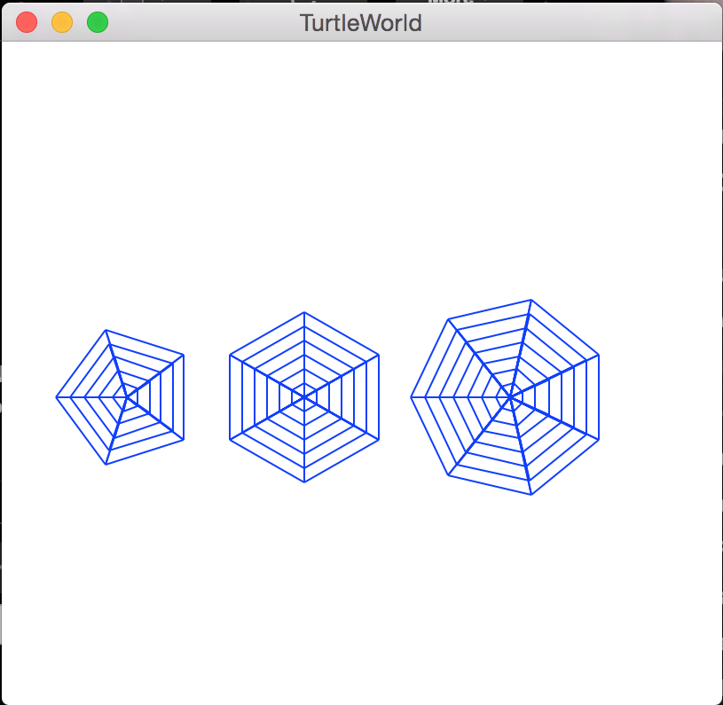

# x9115wig - hw/code/2
Location of second of CSC 791 code assignments

##This homework was broken down into multiple assignments.
###Excercises 3.1, 3.2, 3.3, 3.4, and 3.5 can be found in think3.py
Exercise 3.1 output:
Traceback (most recent call last):
  File “think3.py”, line 4, in <module>
    repeat_lyrics()
NameError: name ‘repeat_lyrics’ is not defined

Excerise 3.2 output:
Everything prints as it should:
I'm a lumberjack, and I'm okay.
I sleep all night and I work all day.
I'm a lumberjack, and I'm okay.
I sleep all night and I work all day.

Exercise 3.3 output:
                                                                 allen

Exercise 3.4 output:
spam
spam

Exercise 3.5 output:
+ - - - - + - - - - +
/         /         /
/         /         /
/         /         /
/         /         /
+ - - - - + - - - - +
/         /         /
/         /         /
/         /         /
/         /         /
+ - - - - + - - - - +
+ - - - - + - - - - + - - - - + - - - - +
/         /         /         /         /
/         /         /         /         /
/         /         /         /         /
/         /         /         /         /
+ - - - - + - - - - + - - - - + - - - - +
/         /         /         /         /
/         /         /         /         /
/         /         /         /         /
/         /         /         /         /
+ - - - - + - - - - + - - - - + - - - - +
/         /         /         /         /
/         /         /         /         /
/         /         /         /         /
/         /         /         /         /
+ - - - - + - - - - + - - - - + - - - - +
/         /         /         /         /
/         /         /         /         /
/         /         /         /         /
/         /         /         /         /
+ - - - - + - - - - + - - - - + - - - - +

###Exercise 4.2 can be found in flower_drawer.py

###Exercise 4.3 can be found in pie_drawer.py
I made the pies have pies inside them for a halloween theme, enjoy

