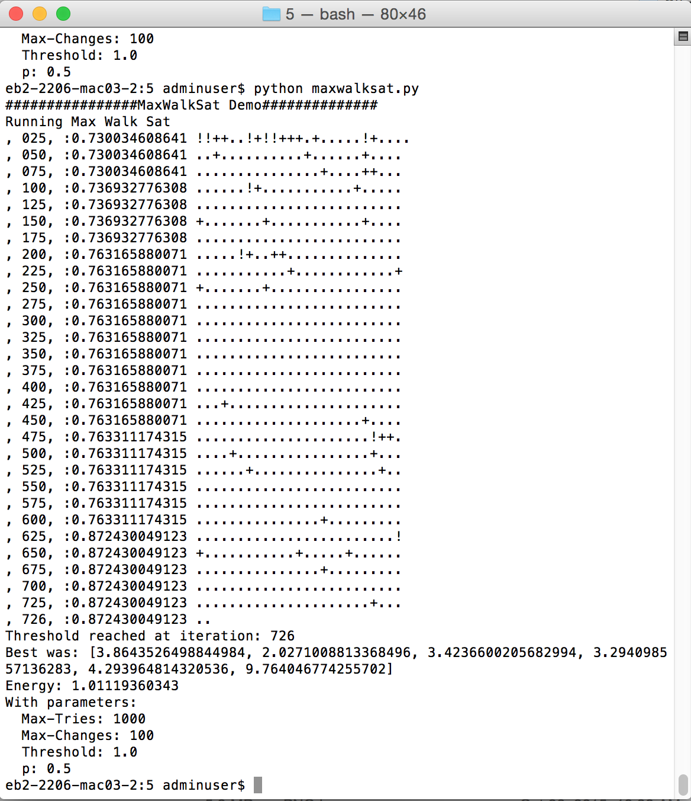

# x9115wig - hw/code/5
Below is my homework 5 submission. You will notice there are no question marks (which in this case would denote a random part of the solution getting changed instead of the element stepping through solutions and picking the best for that part) because since that decision has a likelihood of .5 over a run and each run has many opportunities for a random jump, all things that were not an improvement would have been a '?' in almost every run. I put in periods instead because it is easier to read.

##Terminal Screenshot

